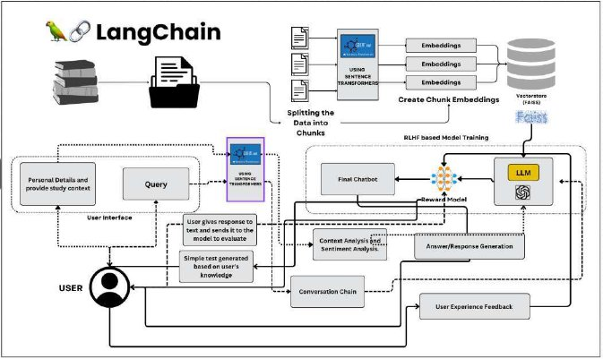
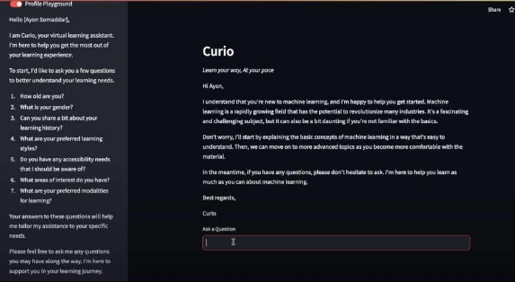
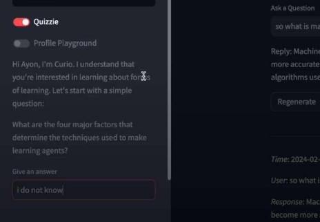
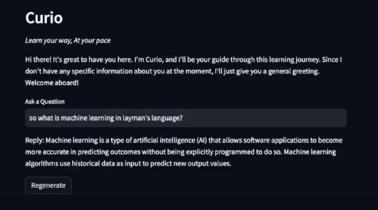
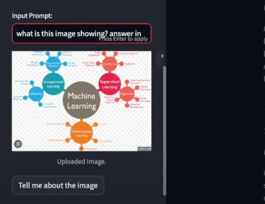

**CURIO: Learn your way, At your pace.** 

We  propose  **“Curio”**,  an  innovative  AI-Powered  application  utilizing  **Large Language  Models(LLM)**  like  **Gemini  Pro**  to  reshape  personalized  E-learning. Integra ng advanced **Natural Language Processing (NLP)** harnessing the power of **Langchain** framework, Curio dynamically and seman cally searches through the educa onal content of the students and answers promptly. As an adaptive applica on, Curio answers as per student’s individual details and personalizes itself as per students learning capabili es.  By tapping into **Gemini Pro's API**, it generates real- me, curriculum-aligned materials that adapt to each student's interests, and preferred learning styles. In addition to these,Curio implements **Reinforcement  Learning  with  Human  Feedback  (RLHF),**  enhancing  learning outcomes by itera vely refining content based on user input for the feedback using a **Reward Model** and **Proximal Policy Optimization (PPO)** . With a user- friendly  interface  and  scalable  architecture,  Curio  promises  to  revolu onize educa onal experiences, making personalized learning accessible and effec ve for students worldwide. 

**Architecture:** 

Our basic architectural implementa on involves a Langchain framework implemen ng the Gemini Pro by Google as a large language model, Faiss by Meta as a vectorstore and other fine tuning methodologies to implement personalisa on and achieve be er results. 

Here is the architectural framework: 

As men oned in the image above, we u lize extensive finetuning techniques like **Reinforcement Learning Human Feedback system, quiz based analysis** and **individual informa on** for personaliza on. Inputs taken by the bot ini ally to uniquely iden fy: 

**Personaliza on architecture** along with implementa on design: 

1. **Profile Playground:** 
- The bot takes survey about the student and fine tunes itself as per the input received.**  
- The model fetches the answers accordingly and generates result. 
- We have named this sec on as the **“Profile Playground”.** It generates survey ques on to enquire about demographics, learning history, and other useful data.** 

2. **Quizzie:** 

   It helps the bot to understand the users domain knowledge. It generates ques on for the user and allows the user to answer that ques on. The reply of the user helps bot to learn about users knowledge depth. 

3. **Regenerate Op ons: **

   This helps to take user feedback from the users about the produced data. 

4. **Document and Image Parsing:** 

   This allows the user to interact with an image or a document and ask ques ons related to it. 

Project GitHub Link:[ h ps://github.com/AyonSOMADDAR/Curio  ](https://github.com/AyonSOMADDAR/Curio)

Check out our bot at : <a href="https://curiobot.streamlit.app/">Curio</a>
